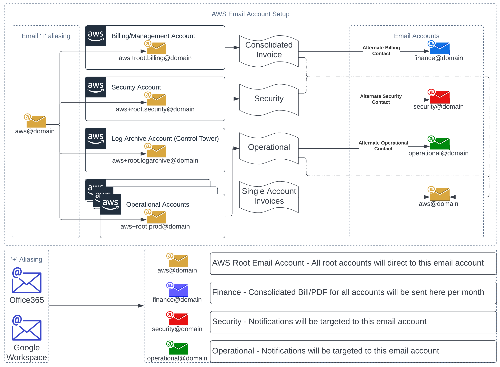
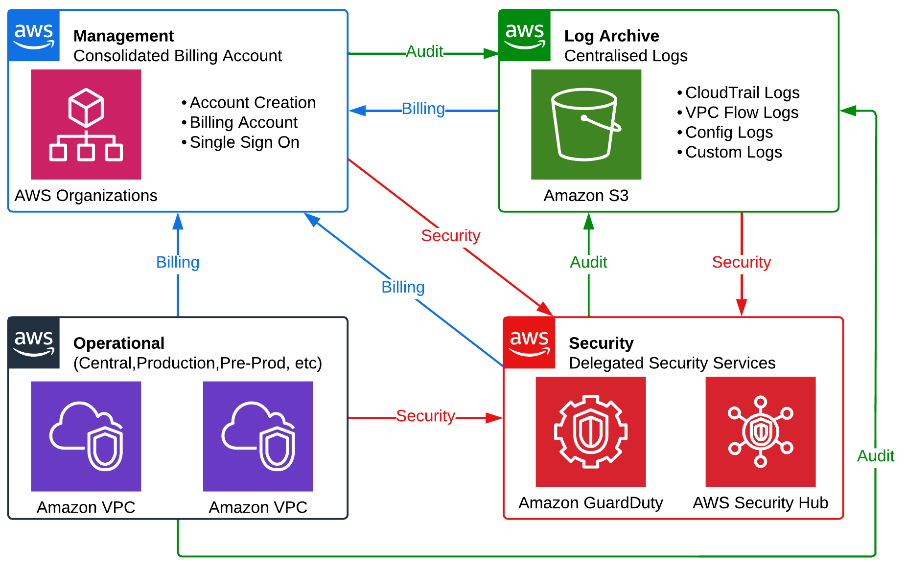

# Email Architecture
## AWS Contact and Email Information
The email contact architecture that is required for the Organisation is shown in the following diagram:


## Account Contact Information
The following contact information should be configured for all AWS Accounts.

There is currently no Terraform resource to apply these settings, these can be applied with the 
[CLI](https://awscli.amazonaws.com/v2/documentation/api/latest/reference/account/put-contact-information.html){:target="_blank"}


Contact Information is a requirement when account access is lost, and proof of ownership is required by AWS

| Contact Information | <div style="width:500px">Information</div> |
| ------------ | -- |
| Full Name    |    |
| Address 1    |    |
| Address 2    |    |
| Address 3    |    |
| City         |    |
| State        |    |
| Postcode     |    |
| Country      |    |
| Phone Number |    |
| Company Name |    |
| Website URL  |    |

## Root Accounts
The general architecture that is required for the AWS Organization is shown in the following diagram:


All AWS Accounts require:

- unique email address for each AWS Account
- An account name that is used for display purposes 
  
They will be stored in ``org/terraform.tfvars`` as :

```hcl
# These would be created (or imported)
root_emails = {
  "Security"    = "aws+root.security@domain.abc"
  "Log Archive" = "aws+root.logarchive@domain.abc"
  "Central"     = "aws+root.central@domain.abc"
  "Production"  = 'aws+root.prod@domain.abc"
  "Development" = "aws+root.dev@domain.abc"
}

# These are used as lookup values
acc_map = {
  Management  = "Actual Account Name"
  Security    = "Actual Account Name"
  LogArchive  = "Actual Account Name"
  Central     = "Actual Account Name"
  Production  = "Actual Account Name"
  Development = "Actual Account Name"
}
```
`root_emails` will create ***member*** accounts with `"Account Name" = "Email Address"`

`acc_map` will contain the terraform lookup value and Account Name (as shown in AWS IAM Identity Center, AWS Organizations etc) of ALL accounts. 

!!! warning 
    ***Before*** running any Workflows, CI/CD or Pipelines, ensure:

    - Email addresses or distribution groups are provisioned and unique
    - Email addresses or distribution groups can *receive* emails from external addresses
    - Triple check the @domain <br />
        Root passwords and functions can *only* be accessed with valid email

!!! note
    Existing Accounts (eg Audit/Security, Log Archive from AWS Control Tower) can be imported into Terraform, and baselined with additional functionality after. This will be typical of **AWS Control Tower Landing Zones**


## Alternate Contacts
Alternate Contacts ensure the correct teams are receiving AWS Account information. They will be stored in `org/terraform.tfvars` as :

```hcl
alt_contacts = <<-CSV
  Function,Name,Title,Email,Phone
  finance,Finance Person,CFO,finance@domain.abc,1300 000 000
  BILLING,IT Billing Person,Manager,aws.billing@domain.abc,1300 000 000
  OPERATIONS,IT Ops Person,Ops,aws.operations@domain.abc,0400 000 000
  SECURITY,IT Security Person,Sec,aws.security@domain.abc,0400 000 000
CSV
```

### Consolidated Invoice
The following email contact will be added for teams responsible for managing the consolidated billing and will be applied to the **Management Account only**. 

This email address will receive the monthly consolidated AWS invoice of all AWS accounts in the AWS Organization.

| Type    | <div style="width:180px">Full Name</div> | Title | Phone | <div style="width:125px">Email Address</div>  | 
| ----------- | ---------------------------------------- | ----- | ----- | --------------------------------------------- |
| Finance |           |       |       | finance@domain |


### Single Account Invoices
The following email contact will be added for teams responsible for managing an individual account. It will be applied to all **member accounts** in the AWS Organization.

This email address will receive a monthly AWS invoice, No payment is required, it is **informational only**.

| Type    | <div style="width:180px">Full Name</div> | Title | Phone | <div style="width:125px">Email Address</div>  | 
| ----------- | ---------------------------------------- | ----- | ----- | --------------------------------------------- |
| BILLING |           |       |       | aws@domain |

### Security
The following email contact will be added for teams responsible for managing Security issues. It will be applied to **all accounts** in the AWS Organization.

This email address will receive security updates from AWS.

| Type    | <div style="width:180px">Full Name</div> | Title | Phone | <div style="width:125px">Email Address</div>  | 
| ----------- | ---------------------------------------- | ----- | ----- | --------------------------------------------- |
| SECURITY |           |       |       | security@domain |


### Operational
The following email contact will be added for teams responsible for managing operational issues. It will be applied to **all accounts** in the AWS Organization.

This email address will receive AWS operational updates from AWS.

| Type        | <div style="width:180px">Full Name</div> | Title | Phone | <div style="width:125px">Email Address</div>  | 
| ----------- | ---------------------------------------- | ----- | ----- | --------------------------------------------- |
| OPERATIONAL |                                          |       |       | operational@domain                            |

