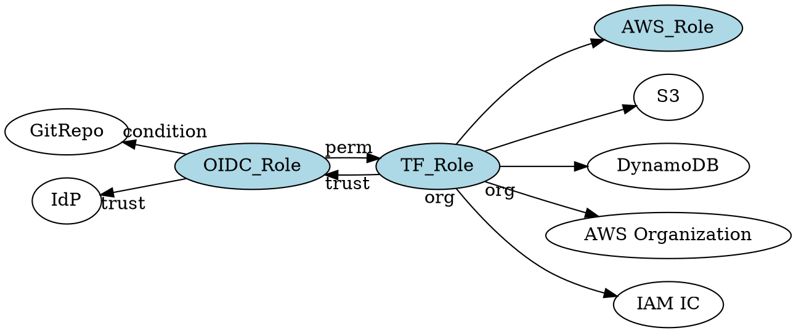
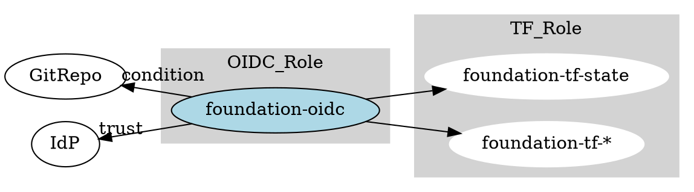
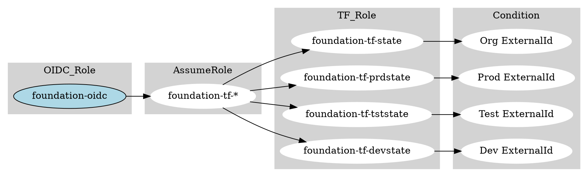
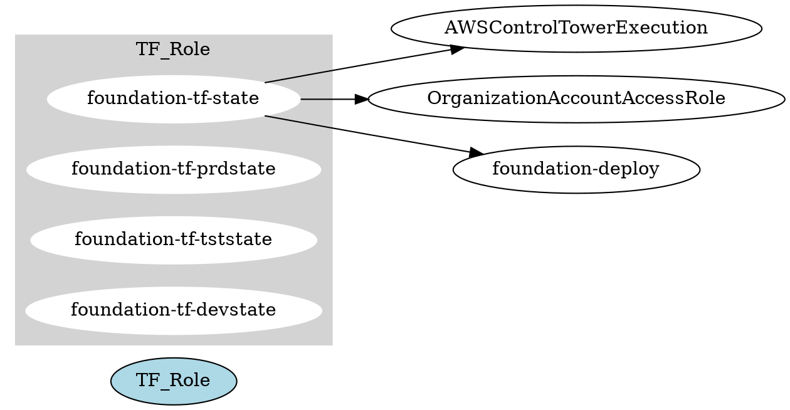

# Role Architecture



## Landing Zone Roles
IAM Roles comprise of two parts for the purposes of Role Based Access Control (RBAC) for the Landing Zone

- **Trust**: Who/What can assume this role

- **Permissions**: What can this role perform

The Landing Zone comprises of three main IAM Role designations

- **OIDC_Role**: Single Entry IAM Role for all OpenID Connect authentication
- **TF_Role**: Single or multiple roles that have access to the Terraform State objects, and the ability to Assume AWS_Role in target accounts for deployment of AWS Resources
- **AWS_Role**: Target Admin Roles in AWS Accounts
  - AWSControlTowerExecution: AWS Control Tower Admin Role that is created on all AWS Member Accounts
  - OrganizationAccountAccessRole: Default AWS Admin Role for AWS Member Accounts
  - foundation-deploy: A custom Admin Role in AWS Member accounts

### OpenID Connect Role

GitOps entry role into the Management account. Roles are the preferred way to perform actions in an AWS environment, and the token must be protected to prevent unintended access.

The role is designed to trust multiple GitOps IdP sources such as GitHub,Bitbucket,GitLab and any future GitOps/Devops tools that support OpenID Connect

**OIDC_Role Defaults**

| <div style="width:100px">Role Name</div> | Trust       | Permissions | <div style="width:115px">Resource</div> |
| ---------------------------------------- | ----------- | ----------- | --------------------------------------- |
| foundation-oidc | **bitbucket** : api.bitbucket.org/2.0/workspaces/*[workspacename]*/pipelines-config/identity/oidc <br /> **gitlab**: gitlab.com or self hosted address <br /> **github**: token.actions.githubusercontent.com  | AssumeRole | foundation-tf-state | 

The OIDC_Role is limited by design and can only assume another role used by Terraform to read/write the various state objects. 

!!! Danger
    Do *not* give the **OIDC_Role** additional permissions outside of **AssumeRole**. 
    
    Access to the Terraform state objects and additional permissions is restricted to the TF_Role(s). 
    
    separation of these Roles is to allow ExternalId as a Condition which cannot be performed with **AssumeRoleWithWebIdentity** and only with **AssumeRole**

Additional roles can be added depending on the GitOps pipelines in place, for example a condition can be added to allow development pipelines to run, but limit access to the required state objects for that environment

Consider the basic OIDC_Role *permissions* that are supplied as part of this Landing Zone.

```json
{
  "Version": "2012-10-17",
  "Statement": [
    {
      "Sid": "GlobalOrgAccess",
      "Effect": "Allow",
      "Action": "sts:AssumeRole",
      "Resource": "arn:aws:iam::*:role/foundation-tf-state"
    }
  ]
}
```

Change these OIDC_Role permissions to have additional roles. Conditions can be added to the TF_Role(s) based on an ExternalId value set in the GitOps process.

```json
{
  "Version": "2012-10-17",
  "Statement": [
    {
      "Sid": "GlobalOrgAccess",
      "Effect": "Allow",
      "Action": "sts:AssumeRole",
      "Resource": "arn:aws:iam::*:role/foundation-tf-*"
    }
  ]
}
```

### Terraform State Role

Terraform role(s) in the Management account.

These role(s) are designed to allow:

- Terraform access to the S3 Bucket and State objects for a given environment
- State Locking tables in DynamoDB
- AssumeRole permissions to AWS Member accounts Administrator Roles

**TF_Role Defaults**

By default, a single TF_Role is supplied with full access to all state objects and ability to create elevated IAM and SSO permissions for the Org project without specifying a role.

This is a basic setup, and intended only for the initial build of the Landing Zone.

| Role Name           | Trust      | Permissions    | Resource                                                                              |
| ------------------- | ---------- | -------------- | ------------------------------------------------------------------------------------- |
| foundation-tf-state | OIDC_ROLE  | AssumeRole     | AWSControlTowerExecution <br> OrganizationAccountAccessRole <br> foundation-deploy    | 
|                     |            | S3<br>DynamoDB | Terraform State                                                                       |
|                     |            | SSO/IAM        | Identity Center/IAM Perms                                                             |
|                     |            | Organizations  | Account/OU/SCP Creation                                                               |

**TF_Role Custom**

Additional roles should be created with **ExternalId** Conditions to faciliate deployment of resources in a less permissive setup

Examples of Roles

| Role Name               | Trust      | Permissions   | Resource                                                                           |
| ----------------------- | ---------- | ------------- | ---------------------------------------------------------------------------------- |
| foundation-tf-prdstate  | OIDC_ROLE <br> **ExternalId** | AssumeRole    | AWSControlTowerExecution <br> OrganizationAccountAccessRole <br> foundation-deploy <br> **Prod Account**| 
|                         |            | S3<br>DynamoDB   | Org **Read** Terraform State <br> **Prod** R/W Terraform State                           |
| foundation-tf-tststate  | OIDC_ROLE <br> **ExternalId** | AssumeRole    | AWSControlTowerExecution <br> OrganizationAccountAccessRole <br> foundation-deploy <br> **Test Account**| 
|                         |            | S3<br>DynamoDB   | Org **Read** Terraform State <br> **Test** R/W Terraform State                           |
| foundation-tf-devstate  | OIDC_ROLE <br> **ExternalId** | AssumeRole    | AWSControlTowerExecution <br> OrganizationAccountAccessRole <br> foundation-deploy <br> **Dev Account**| 
|                         |            | S3<br>DynamoDB   | Org **Read** Terraform State <br> **Dev** R/W Terraform State                           |


#### Typical Role Trust

```json
{
  "Version": "2012-10-17",
  "Statement": [
    {
      "Sid": "ProdAccess",
      "Effect": "Allow",
      "Action": "sts:AssumeRole",
      "Principal": {
        "AWS": "arn:aws:iam::123456789012:role/foundation-oidc"
      },
      "Condition": {
        "StringEquals": {
          "sts:ExternalId": "123Prod456"
        }
      }
    }
  ]
}
```

#### Typical Role Permissions

AssumeRole to Member Accounts
```json
{
    "Version": "2012-10-17",
    "Statement": [
        {
            "Sid": "AssumeAll",
            "Effect": "Allow",
            "Action": "sts:AssumeRole",
            "Resource": [
                "arn:aws:iam::*:role/foundation-deploy",
                "arn:aws:iam::*:role/OrganizationAccountAccessRole",
                "arn:aws:iam::*:role/AWSControlTowerExecution"
            ]
        }
    ]
}
```

Access DynamoDB Table (Terraform State Locking)
```json
{
    "Version": "2012-10-17",
    "Statement": [
        {
            "Sid": "AccessDynamoDB",
            "Effect": "Allow",
            "Action": [
                "dynamodb:PutItem",
                "dynamodb:GetItem",
                "dynamodb:DescribeTable",
                "dynamodb:DeleteItem"
            ],
            "Resource": "arn:aws:dynamodb:ap-southeast-2:123456789012:table/foundation-tfstate"
        },
        {
            "Sid": "AccessDynamoDBTableList",
            "Effect": "Allow",
            "Action": "dynamodb:ListTables",
            "Resource": "arn:aws:dynamodb:*:*:table/*"
        }
    ]
}
```

S3 Access (Terraform S3 Backend)
```json
{
    "Version": "2012-10-17",
    "Statement": [
        {
            "Sid": "AccessListS3",
            "Effect": "Allow",
            "Action": "s3:ListBucket",
            "Resource": "arn:aws:s3:::uniqueprefix-trustypangolin-tfstate"
        },
        {
            "Sid": "AccessS3All",
            "Effect": "Allow",
            "Action": [
                "s3:ListAllMyBuckets",
                "s3:GetBucketLocation"
            ],
            "Resource": "arn:aws:s3:::*"
        },
        {
            "Sid": "AccessS3",
            "Effect": "Allow",
            "Action": [
                "s3:PutObject",
                "s3:GetObject",
                "s3:GetEncryptionConfiguration",
                "s3:DeleteObject"
            ],
            "Resource": [
                "arn:aws:s3:::uniqueprefix-trustypangolin-tfstate/production/*",
                "arn:aws:s3:::uniqueprefix-trustypangolin-tfstate/infrastructure/*",
                "arn:aws:s3:::uniqueprefix-trustypangolin-tfstate/foundation/*"
            ]
        }
    ]
}
```

##### TF_Role Org Permissions

Account Creation Permissions (Org Project)
```json
{
    "Version": "2012-10-17",
    "Statement": [
        {
            "Sid": "AccessOrgValues",
            "Effect": "Allow",
            "Action": [
                "organizations:UpdatePolicy",
                "organizations:UntagResource",
                "organizations:TagResource",
                "organizations:List*",
                "organizations:Enable*",
                "organizations:Describe*",
                "organizations:CreatePolicy",
                "backup:UpdateGlobalSettings",
                "backup:DescribeGlobalSettings"
            ],
            "Resource": "*"
        }
    ]
}
```

Elevated Permissions (Org Project)
```json
{
    "Version": "2012-10-17",
    "Statement": [
        {
            "Sid": "AccessOrgValues",
            "Effect": "Allow",
            "Action": [
                "sso:*",
                "iam:*"
            ],
            "Resource": "*"
        }
    ]
}
```


### Deployment Roles



AWS_Role covers the role created by AWS on Account creation.

| Landing Zone Type | Role Name | 
| --- | --- |
| AWS Control Tower | AWSControlTowerExecution |
| Default Member    | OrganizationAccountAccessRole |
| Custom Member     | foundation-deploy |

