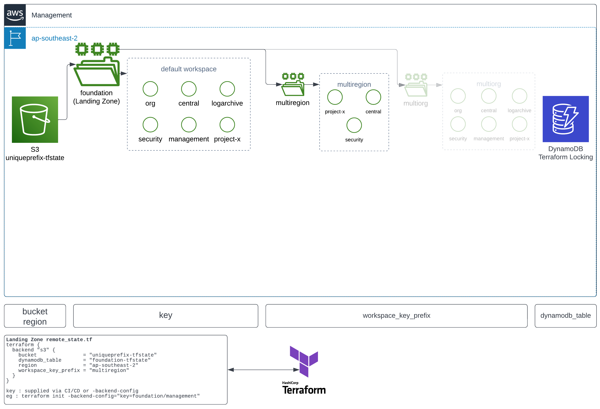
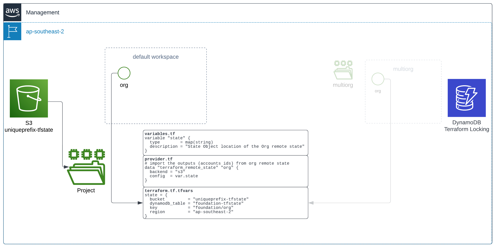

# State Architecture
## Landing Zone State
The Terraform State architecture for the complete Landing Zone is shown in the following diagram:

With the use of [Terraform Workspaces](https://developer.hashicorp.com/terraform/language/state/workspaces#using-workspaces){:target="_blank"}, the Landing Zone supports 'Multi-Region' and also 'Multi-Org' deployments from a single code base

## Multi-Region
While most resources in the Landing Zone are deployed within the same default workspace with the use of provider aliases (eg AWS Config, Security Hub etc), it is also a supported deploymentf for similar resources using common infrastructure as code without using aliases and repeated code. This is useful in multi-region environments where common resources have only a region difference

Consider a typical VPC module deployment without workspaces and two regions

```hcl
module "modules_vpc_sydney" {
  provider            = aws.sydney
  source              = "../modules/regional/network/"
  network_prefix      = "10.0"
  env                 = "prod"
}

module "modules_vpc_singapore" {
  provider            = aws.singapore
  source              = "../modules/regional/network/"
  network_prefix      = "10.1"
  env                 = "prod"
}
```

Converted to a workspace within the Landing Zone framework

```hcl
module "modules_vpc" {
  source              = "../modules/regional/network/"
  network_prefix      = local.workspace["vpccidr"]
  env                 = local.workspace["environment"]
}
```

The values for each region are handled by the `workspace.tf` file which merges default values (Sydney) with changed custom values (Singapore) and evaluates these based on the selected workspace.

## Multi-Org
Similar to Multi-Region in application, the state of a completely different AWS Organization can be stored and deployed from the base Landing Zone IaC with only a change in the `workspace.tf` file.

This is useful for situations where an alternate AWS Organization and complete AWS Account structure is required (eg a Development or Training AWS Organization), but still maintain the deployment of those from a common project

!!! Note
    The alternate Management Account will still need to be created seperately for billing purposes, and Bootstrapped accordingly with the equivalent TF_Role role

## S3 State objects
The following is the typical key/object state tree setup for the Landing Zone:
```
uniqueprefix-tfstate
└── foundation
    |
    # These objects relate to each AWS Account in the default workspace
    ├── central
    ├── logarchive
    ├── management
    ├── org
    ├── production
    └── security
 
    # This key contains state objects for other regions (eg central/prod/etc)
    └── multiregion
        └── foundation 
            ├── central
            ├── production
            └── development

    # This key contains state objects for other AWS orgs
    └── multiorg
        └── foundation 
            ├── org
            ├── management
            ├── logrchive
            └── security
```

### Org
`terraform/org` contains the derived account numbers and names, global values, AWS IAM Identity Center and AWS Organization layouts

It is an important project because it is responsible for maintaining the current account layout, and global variables

The state object for this project will be referenced as a [remote state](https://registry.terraform.io/providers/hashicorp/terraform/latest/docs/data-sources/remote_state){:target="_blank"} in all other projects. This will keep all other projects ['DRY'](https://en.wikipedia.org/wiki/Don%27t_repeat_yourself){:target="_blank"} and negate the need for constant find/replace when applying the Landing Zone or other Terraform project code on multiple environments

#### Remote State Data Resource
A typical terraform project will reference the Org Remote State object for any given [workspace](https://developer.hashicorp.com/terraform/language/state/workspaces#using-workspaces){:target="_blank"} for any of these values

| Description | Output | <div style="width:400px">Example reference</div> |
| ------------- | -------------- | ------------------------------------------------------|
| Customer Name | unique_prefix  | <pre>data.terraform_remote_state.org.outputs.unique_prefix</pre>|
| First Region  | base_region    | <pre>data.terraform_remote_state.org.outputs.base_region</pre>|
| Member Role   | base_role      | <pre>data.terraform_remote_state.org.outputs.base_role</pre>|
| Account Number| acc & acc_map  | <pre>data.terraform_remote_state.org.outputs.acc[ <br>  data.terraform_remote_state.org.outputs.acc_map[<br>    "Security" <br>  ]<br>]</pre>|

Other values are also available in `org/output.tf`

- AWS Organization values
- Email accounts (eg notifications)
- Control Tower status
- Other global variables (eg Datadog, Grafana) common to all projects

Remote State architecture is shown in the following diagram:


`teraform.tf.tfvars` and the `state` value is base64 stored in secrets as `BEDROCK_TF_VARS`, so it is accessible to all projects within the DevOps scripts.