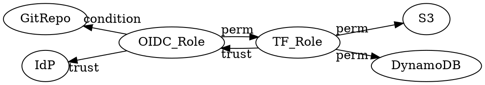

Usage
===

Quick Start Landing Zone Code
---
To use APAC (AWS) Landing Zone Template, first clone the git repo with the preferred DevOps framework:

**GitHub Actions**

    git clone https://github.com/trustypangolin/apac-landing-zone-template

**GitLab CI/CD**

    git clone https://gitlab.com/trustypangolinhq/apac/apac-landing-zone-template


!!! note
    Bitbucket Piplines, GitLab CI/CD and GitHub Actions are all included regardless of the repo chosen

Management AWS Account
---
The landing zone will need the initial AWS account to be created and *bootstrapped* with authentication and terraform state resources. 

All other sub accounts are created as part of the CI/CD process, but they will all need unique email addresses that are accessible and secure to retrieve root passwords

!!! warning 
    ***Before*** running any workflows, CI/CD or Pipelines, ensure:

    - Email addresses or distribution groups are provisioned and unique
    - Email addresses or distribution groups can *receive* emails from external addresses
    - Triple check the @domain <br />
        Root passwords and functions can *only* be accessed with valid email

!!! note
    Existing Accounts can be imported into Terraform, and baselined after


Bootstrap Resources
---
GitHub/GitLab/Bitbucket will use OpenID Connect (OIDC) to authenticate to the AWS Management Account

This can be setup with the provided Terraform code, or a CloudFormation template 

**CloudFormation**: [cloudformation](https://github.com/trustypangolin/apac-landing-zone-template/tree/main/cloudformation){:target="_blank"}

**Terraform**: [terraform](https://github.com/trustypangolin/apac-landing-zone-template/tree/main/terraform){:target="_blank"}


Either method will create the following AWS resources



| AWS Resource | Description  | Value  |  
|--------------|---|---|
| IdP          | Identity Provider  | **bitbucket** : api.bitbucket.org/2.0/workspaces/*[workspacename]*/pipelines-config/identity/oidc <br /> **gitlab**: gitlab.com or self hosted address <br /> **github**: token.actions.githubusercontent.com |  
| OIDC_Role    | OIDC IAM Role  |  foundation-terraform-oidc |  
| TF_Role      | Terraform Role  |  foundation-tf-state |  
| S3           | Terraform S3 Bucket | **uniqueprefix**-tfstate   | 
| DynamoDB     | Terraform DynamoDB | foundation-tfstate |

DevOps Authentication Flow
---
```plantuml classes="uml myDiagram" alt="Diagram placeholder" title="My diagram"
@startuml

  box "Git Cloud" #LightBlue
  participant Repo
  participant Pipeline
  participant Token
  end box

  box "AWS" #Orange
  participant "AWS IdP"
  participant OIDC_Role
  participant TF_Role
  participant S3
  participant DynamoDB
  end box

  autonumber
  Repo -> Pipeline: Workflow
  Pipeline -> Token: Generate
  Token -> "AWS IdP" : JSON
  "AWS IdP" <- OIDC_Role : Trust
  Repo <- OIDC_Role  : Condition
  Pipeline <- OIDC_Role  : Temporary Credentials
  Pipeline -> OIDC_Role : AssumeRoleWithWebIdentity
  OIDC_Role -> TF_Role : AssumeRole
  TF_Role -> S3 : State
  TF_Role -> DynamoDB : State Locking
@enduml
```

Git Secrets
---
The following secrets are required in GitHub/GitLab/Bitbucket

| Secret           | Example Value      | <div style="width:200px">Generate</div>                         |  Description                               |
|------------------|--------------------|-----------------------------------------------------------------|--------------------------------------------|
| AWS_ROOT_ACCOUNT | 123456789012       | ``aws sts get-caller-identity \``<br>`` --query "Account" --output text`` | **Management** Account Id                  |
| BEDROCK_TF_STATE | dGVyc...UiCiAgfQp9 | ``awk 'NF && ! /#/' \``<br>``remote_state.tf | base64``                  | Base64 encoded **org**/remote_state.tf     |
| BEDROCK_TF_VARS  | dW5pcXVlX...uIgp9e | ``awk 'NF && ! /#/' \``<br>``terraform.tfvars | base64``                 | Base64 encoded **org**/terraform.tfvars    | 
| ENCKEY           | SecretValue        | Password                                                        | Encodes AWS Credentials in CI/CD artifacts | 


<!-- prettier-ignore -->
*[MOCDOC]: Mock Documentation
